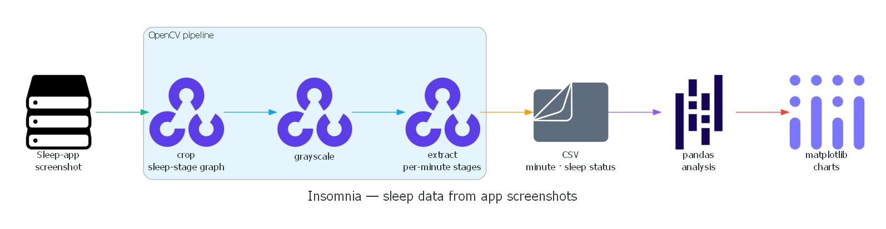
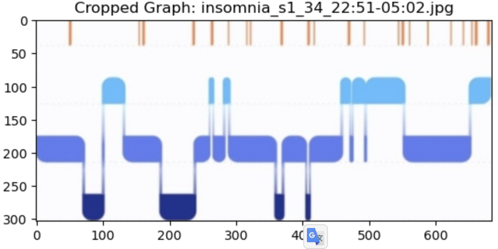
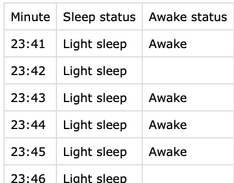

# Insomnia — sleep data from screenshots

A pipeline that turns **sleep-tracking app screenshots into structured, analyzable
data**. It crops the sleep-stage graph out of each screenshot, grayscales it, reads
the per-minute sleep stages, writes them to CSV, and analyzes sleep patterns.

**Stack:** Python · OpenCV · Pandas · Matplotlib · Jupyter



*Rendered from [`docs/howitworks.py`](docs/howitworks.py) (Python `diagrams` library).*

## Pipeline

```
screenshot → crop graph → grayscale → read per-minute stages → CSV → analysis
```

| Cropped sleep-stage graph | Structured output |
| --- | --- |
|  |  |

## Contents

- `Insomnia.ipynb` — the full pipeline + analysis (with inline result plots).
- `crop.png` · `grayscale.png` · `csv.png` — pipeline-step illustrations.

## Note

The raw sleep-app screenshots and per-sample outputs are not included (personal /
bulk data) — see `.gitignore`.
